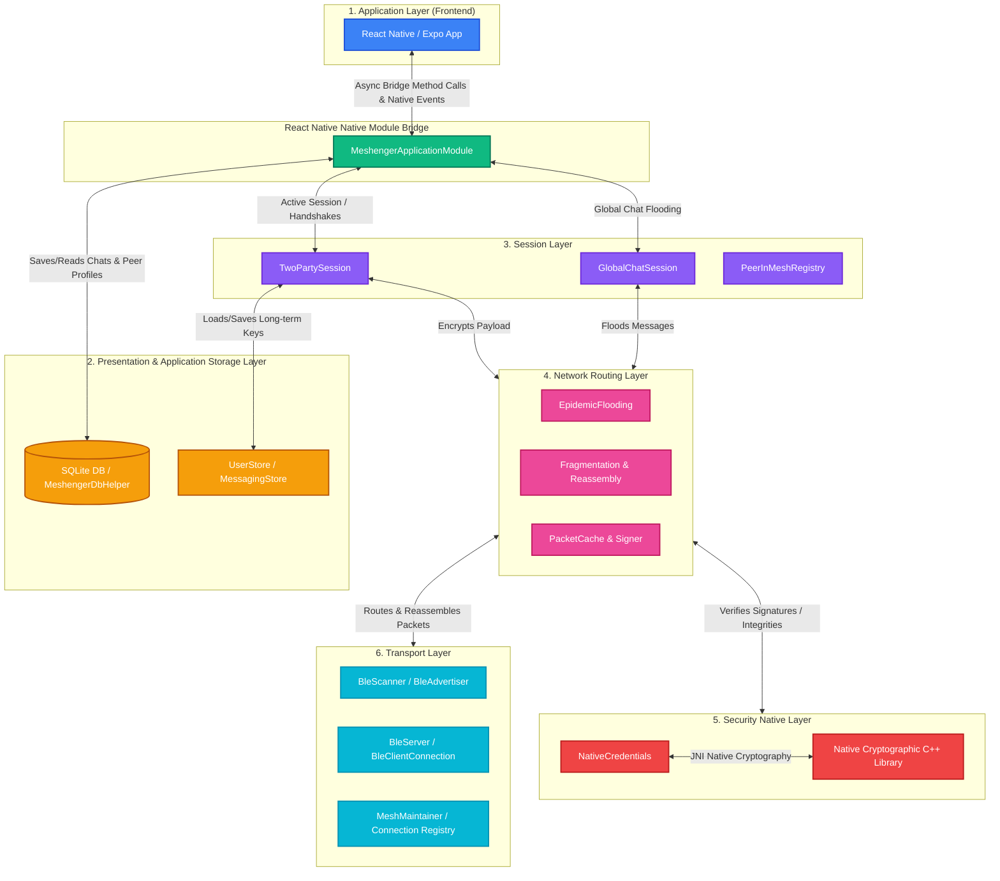
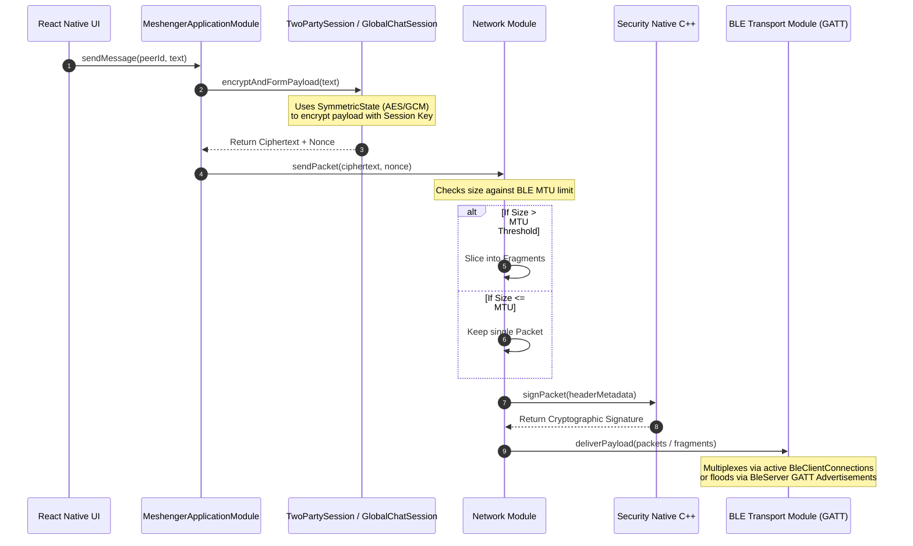
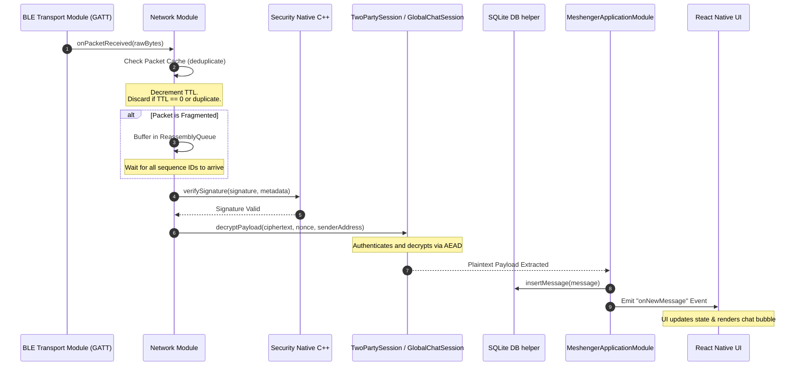

# Meshenger Overall Architecture

This document presents a comprehensive, structured overview of the **Meshenger** system architecture—a decentralized, peer-to-peer (P2P) messaging application operating over Bluetooth Low Energy (BLE) mesh networks. It details the layered structure, modules, message-handling flows, and secure protocols that enable offline communication without server infrastructure.

---

## 1. Architectural Layers Overview

Meshenger is organized into a five-layer model that isolates responsibilities, ensuring that each part of the system can be developed and maintained independently.



---

## 2. Core Technical Modules

The codebase is structured under the `meshenger` directory into independent Gradle modules (except the React Native frontend), which are dynamically linked during the Android build:

### 2.1. Frontend Module (`meshenger/frontend`)
*   **Technologies**: TypeScript, React Native, Expo Router, Context API, Vanilla CSS.
*   **Responsibility**: Powers the visual interface, screen navigation, and user interaction.
*   **Key Directories**:
    *   [`app/index.tsx`](file:///c:/Users/lepha/Desktop/workonavt/meshenger/frontend/app/index.tsx): App bootstrap entry point.
    *   [`app/Onboarding`](file:///c:/Users/lepha/Desktop/workonavt/meshenger/frontend/app/Onboarding): Handles user setup, including choosing display name and persisting selected avatars.
    *   [`app/ChatBox`](file:///c:/Users/lepha/Desktop/workonavt/meshenger/frontend/app/ChatBox): Chat conversation feed listing (pins Global Chat at the top).
    *   [`app/Chat`](file:///c:/Users/lepha/Desktop/workonavt/meshenger/frontend/app/Chat): Handles standard chat input, emoji rendering, and rendering messages.
    *   [`app/DeviceScan`](file:///c:/Users/lepha/Desktop/workonavt/meshenger/frontend/app/DeviceScan): Scans for nearby peers, and connects with them.
    *   [`app/QRScan`](file:///c:/Users/lepha/Desktop/workonavt/meshenger/frontend/app/QRScan): Facilitates secure identity exchanges through QR codes.

### 2.2. Application Module (`meshenger/application`)
*   **Technologies**: Kotlin, SQLite.
*   **Responsibility**: Orchestrates high-level business flows and exposes native Kotlin methods directly to the React Native JS thread.
*   **Key Classes**:
    *   [`MeshengerApplicationModule`](file:///c:/Users/lepha/Desktop/workonavt/meshenger/application/src/main/java/com/meshenger/backend/application/MeshengerApplicationModule.kt): The primary React Native Native Module. Bridges all frontend requirements to the low-level transport. Emits JS events like `onNewMessage` and `onMessageStatusChanged`.
    *   [`MeshengerDbHelper`](file:///c:/Users/lepha/Desktop/workonavt/meshenger/application/src/main/java/com/meshenger/backend/application/db/MeshengerDbHelper.kt): Formulates schemas and operates the persistent SQLite storage for peer profiles and encrypted message histories.
    *   [`UserStore`](file:///c:/Users/lepha/Desktop/workonavt/meshenger/application/src/main/java/com/meshenger/backend/application/user/UserStore.kt) & [`MessagingStore`](file:///c:/Users/lepha/Desktop/workonavt/meshenger/application/src/main/java/com/meshenger/backend/application/messaging/MessagingStore.kt): Simple abstractions on top of SQLite to save user profiles and message lists.

### 2.3. Session Module (`meshenger/session`)
*   **Technologies**: Kotlin, Noise Protocol.
*   **Responsibility**: Establishes secure communication sessions between mesh peers.
*   **Key Classes**:
    *   [`TwoPartySession`](file:///c:/Users/lepha/Desktop/workonavt/meshenger/session/src/main/java/com/meshenger/backend/session/TwoPartySession.kt): Manages 1-to-1 secure channels using Noise Protocol handshakes. Evaluates handshake patterns: **Noise XX** (mutual authentication on standard mesh connections), **Noise XK** (pairing using pre-shared key scanned from QR code), and **Noise KK** (rapid reconnect using cached static keys).
    *   [`GlobalChatSession`](file:///c:/Users/lepha/Desktop/workonavt/meshenger/session/src/main/java/com/meshenger/backend/session/GlobalChatSession.kt): Handles global broadcasting across the mesh where packets are readable by any connected node.
    *   [`PeerInMeshRegistry`](file:///c:/Users/lepha/Desktop/workonavt/meshenger/session/src/main/java/com/meshenger/backend/session/PeerInMeshRegistry.kt): Manages a dynamic, in-memory list of active mesh nodes seen during peer discovery.

### 2.4. Network Module (`meshenger/network`)
*   **Technologies**: Kotlin.
*   **Responsibility**: Performs packet compilation, routing, and message recovery mechanisms.
*   **Key Classes**:
    *   [`EpidemicFlooding`](file:///c:/Users/lepha/Desktop/workonavt/meshenger/network/src/main/java/com/meshenger/backend/network/EpidemicFlooding.kt): Implements epidemic routing (gossip protocols) to flood broadcast and group packets systematically across all visible mesh links.
    *   [`Packet`](file:///c:/Users/lepha/Desktop/workonavt/meshenger/network/src/main/java/com/meshenger/backend/network/Packet.kt): Structuring of data payloads, specifying standard headers like Time-To-Live (TTL), sender addresses, sequence identifiers, and integrity signatures.
    *   [`Fragment`](file:///c:/Users/lepha/Desktop/workonavt/meshenger/network/src/main/java/com/meshenger/backend/network/Fragment.kt) & [`ReassemblyQueue`](file:///c:/Users/lepha/Desktop/workonavt/meshenger/network/src/main/java/com/meshenger/backend/network/ReassemblyQueue.kt): Slices messages exceeding maximum transmission size constraints into smaller BLE-digestible chunks, re-aligning and assembling fragments in sequential order on arrival.
    *   [`PacketCache`](file:///c:/Users/lepha/Desktop/workonavt/meshenger/network/src/main/java/com/meshenger/backend/network/PacketCache.kt): Tracks recently processed packets. Prevents infinite looping and duplicate transmissions by immediately dropping cached packets.

### 2.5. Security Native Module (`meshenger/security-native`)
*   **Technologies**: Kotlin, Native C++, JNI.
*   **Responsibility**: Accelerates performance-critical and high-risk cryptographic computations securely in compiling native machine code.
*   **Key Classes**:
    *   [`NativeCredentials`](file:///c:/Users/lepha/Desktop/workonavt/meshenger/security-native/src/main/java/com/meshenger/backend/security_native/NativeCredentials.kt): Integrates the Android JNI wrapper around underlying C++ algorithms (e.g. `signature-check.cpp`, `NativeCredentials.cpp`) to handle high-level key derivations and signature verification.

### 2.6. Transport Module (`meshenger/transport2`)
*   **Technologies**: Kotlin, Android Bluetooth Low Energy APIs.
*   **Responsibility**: Operates direct peer-to-peer wireless connections via BLE.
*   **Key Classes**:
    *   [`BleScanner`](file:///c:/Users/lepha/Desktop/workonavt/meshenger/transport2/src/main/java/com/meshenger/backend/transport2/client/BleScanner.kt) & [`BleAdvertiser`](file:///c:/Users/lepha/Desktop/workonavt/meshenger/transport2/src/main/java/com/meshenger/backend/transport2/server/BleAdvertiser.kt): Drives passive and active BLE discovery loops to broadcast peer presence and scan local frequency spectrums for other active nodes.
    *   [`BleServer`](file:///c:/Users/lepha/Desktop/workonavt/meshenger/transport2/src/main/java/com/meshenger/backend/transport2/server/BleServer.kt) & [`BleClientConnection`](file:///c:/Users/lepha/Desktop/workonavt/meshenger/transport2/src/main/java/com/meshenger/backend/transport2/client/BleClientConnection.kt): Establishes point-to-point BLE GATT (Generic Attribute Profile) client-server relationships.
    *   [`MeshMaintainer`](file:///c:/Users/lepha/Desktop/workonavt/meshenger/transport2/src/main/java/com/meshenger/backend/transport2/MeshMaintainer.kt): Monitors connection qualities and initiates automated re-connection handshakes.
    *   [`MPAddress`](file:///c:/Users/lepha/Desktop/workonavt/meshenger/transport2/src/main/java/com/meshenger/backend/transport2/MPAddress.kt): Manages custom dynamic routing addresses.

---

## 3. Advanced Architectural Mechanisms

### 3.1. Ephemeral Mesh Protocol Address (`MPAddress` Rotation)
To prevent adversarial device-tracking and surveillance, Meshenger utilizes **ephemeral routing addresses**.
*   Instead of exposing static physical MAC addresses or long-term public keys directly, every device dynamically derives an 8-byte **Mesh Protocol Address** (`MPAddress`).
*   This address is calculated using HKDF (HMAC-based Extract-and-Expand Key Derivation) with:
    1.  The device's **long-term public identity key** as Input Keying Material (IKM).
    2.  A localized salt value.
    3.  A dynamic epoch index changing every 24 hours (`currentTime / epochHours`).
    4.  An `AppSecretKey` managed securely by the Native C++ cryptographic layer.
*   Because the address shifts deterministically every 24 hours, passive sniffers cannot track a user's location or physical associations over long periods.

```
MPAddress = HKDF-SHA256(
    IKM    = Local Identity Public Key,
    Salt   = Pre-defined Static Salt,
    Info   = Application Secret Key + Epoch Index (Derived from current time in 24h intervals)
)
```

### 3.2. Noise Protocol & End-to-End Encryption
Secure 1-to-1 channels utilize the Noise Protocol Framework for strong end-to-end encryption:
1.  **Noise XX (Mutual Authentication)**: Initiates when two users connect natively on the mesh for the first time. Both parties exchange and verify their static public keys dynamically during the multi-step handshake.
2.  **Noise XK (Scanned QR Connection)**: Used when one user scans another user's QR code containing their static public key. The scanner initiates the session knowing the responder's static key, bypassing intermediate active-attacker vulnerabilities (MitM).
3.  **Noise KK (Fast Reconnect)**: If two users have successfully completed an XX or XK handshake, their mutual static public keys are persisted. Upon re-entering range, they execute a highly optimized Noise KK handshake, verifying identity and deriving fresh ephemeral keys in just 1 round trip.

---

## 4. End-to-End Data Flows

### 4.1. Message Transmission Flow (Send Message)

The flow below tracks a message submitted by the user in the UI, down to native bytes sent over the air:



### 4.2. Message Reception Flow (Receive Message)

The process by which incoming physical radio waves are reconstructed, decrypted, and bubble up to display to the user:



---

## 5. Architectural Quality Attributes

*   **Offline Independence**: Zero dependency on central servers, DNS lookups, or cell tower routing. Point-to-point BLE links build their own local routing mesh automatically.
*   **Privacy-by-Design**: Encrypted databases, local-only caching, ephemeral protocol addresses (`MPAddress`), and end-to-end encrypted packet flows. Even intermediate nodes relaying messages can never inspect contents or track static device signatures.
*   **Reliability & Resilience**: Built-in automatic message fragmentation handles variable BLE MTUs. Epidemic flooding handles unstable nodes, ensuring that as long as an active path of devices exists (even if fluctuating), packets eventually reach their target.
*   **Battery and Resource Efficiency**: Standardized BLE GATT clients and servers operate efficiently, sleeping and waking automatically via Kotlin flow states rather than keeping constant CPU wake-locks.
